<div align="center">


# Tidy

### Tell your Mac what to do with your files — in plain English.<br/>Review exactly what will happen. Undo anything.

[](https://github.com/NicolasLasch/Tidy/actions/workflows/ci.yml)
[](https://github.com/NicolasLasch/Tidy/releases)
[](https://github.com/NicolasLasch/Tidy/releases)
[](LICENSE)


[](https://github.com/NicolasLasch/Tidy/stargazers)

[**Download**](https://github.com/NicolasLasch/Tidy/releases/latest) · [Try it in 2 minutes](#-try-it-in-2-minutes) · [How it works](docs/ARCHITECTURE.md) · [How AI is used](docs/HOW-AI-IS-USED.md) · [Benchmarks](docs/BENCHMARKS.md) · [Ideas](docs/IDEAS.md)

<br/>


</div>

---

## Why Tidy?

Your Mac's storage is a mystery, organizing thousands of files by hand takes an afternoon, and nobody trusts a bot with `rm -rf`.

**Tidy fixes all three.** Type what you want. Tidy shows *exactly* which files and folders it would touch, with sizes. You approve. Everything goes to the Trash with a recorded location, so any change can be undone from inside the app.

<table>
<tr>
<td width="33%" valign="top">

### 🗣️ Plain English
“Delete the 10 biggest files”, “organize by date”, “remove the instances that aren't the 26.2 version”. No rules to learn.

</td>
<td width="33%" valign="top">

### 🛡️ Safe by construction
Opt-in folders, review-then-approve, no overwrites, no permanent deletes, a durable journal and one-click **Put back**.

</td>
<td width="33%" valign="top">

### 🔒 Fully local
No account, no cloud, no telemetry. The optional AI model runs on your Mac; your files never leave it.

</td>
</tr>
</table>

## ✨ Features

<table>
<tr>
<td width="50%" valign="top">

**💬 Chat that actually does things**<br/>
Create, move, rename, delete, sort, de-duplicate, change extensions — with folder-name fuzziness (“life and hell” → `liveandhell-template`), lists (“delete A, B and C”), **multi-step requests** (“rename X to Y and move it into Z”, “create a folder Invoices and move the PDFs into it”) and follow-ups (“delete all of them”).

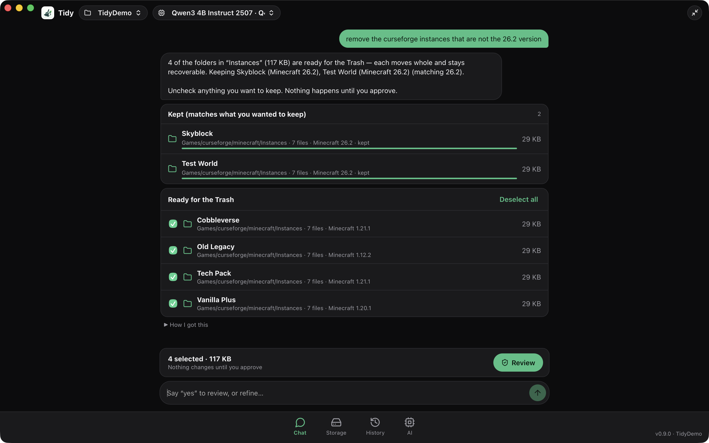

</td>
<td width="50%" valign="top">

**💽 A disk explorer that tells the truth**<br/>
Every folder on your Mac with its real allocated size, cached so it opens instantly and refreshed in the background. Drill in, sort by size/name/date, open any file's location, trash it — and see *why* 800 GB are used.

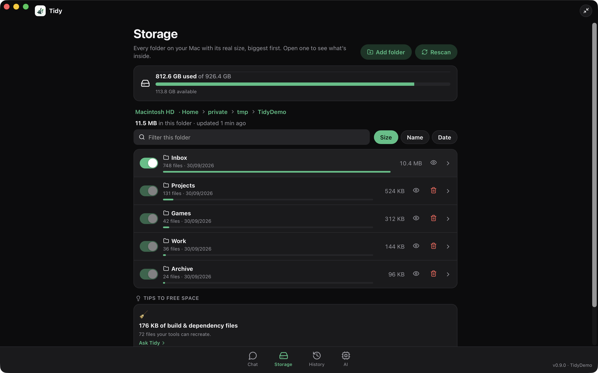

</td>
</tr>
<tr>
<td width="50%" valign="top">

**🕘 History with Put back**<br/>
Every change is journaled: where it was, where it went, where it is in the Trash. Undo a batch of moves, or put a trashed folder back — Tidy refuses to overwrite anything.

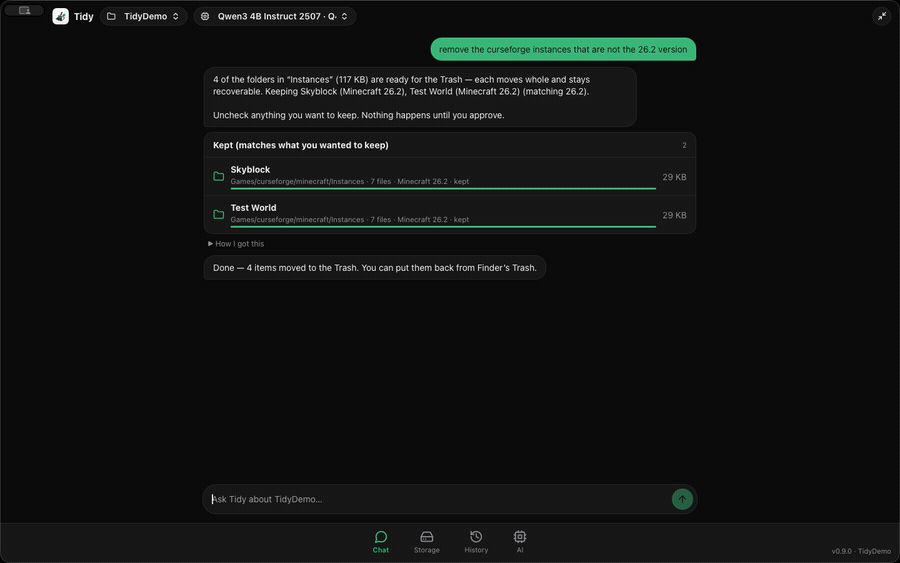

</td>
<td width="50%" valign="top">

**🧠 Bring your own model**<br/>
Instant deterministic engine for everyday requests; an optional local model (Qwen3 by default) for unusual ones. Paste any Hugging Face `.gguf` link to add your own, pinned by checksum.

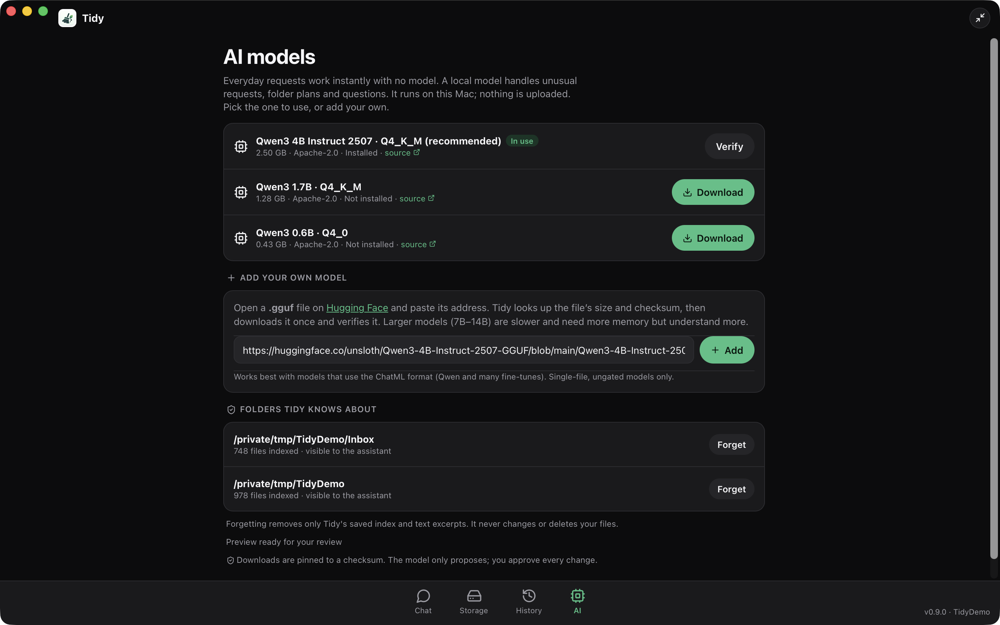

</td>
</tr>
</table>

<details>
<summary><b>More: a tiny always-on-top assistant, light &amp; dark, and everything reachable from the keyboard</b></summary>

<p align="center">
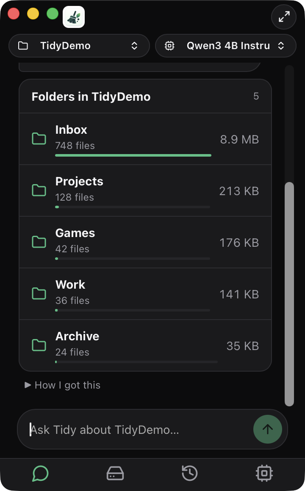
&nbsp;&nbsp;
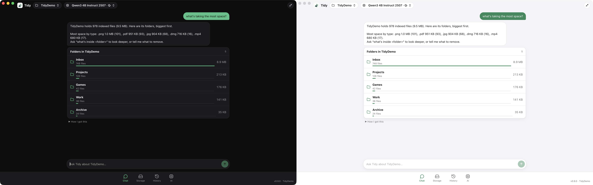
</p>

The shrink button turns Tidy into a 360×580 assistant pinned to a screen corner (Esc to expand). All screens stay reachable from its icon bar.

</details>

## 🎬 See it in action

| You say | Tidy does | |
|---|---|---|
| “**What's taking the most space?**” | Cards for every top-level folder with sizes and bars; click one to open it. | 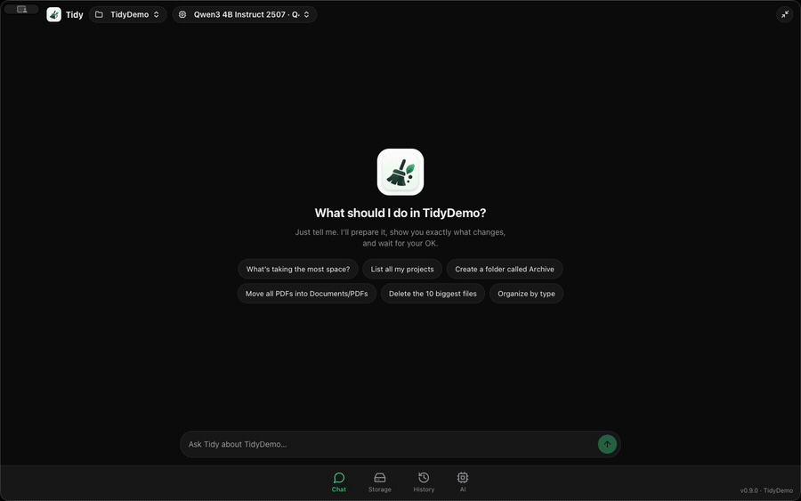 |
| “**Remove the curseforge instances that are not the 26.2 version**” | Reads each instance's own version file, keeps the matches, lists the rest whole. | 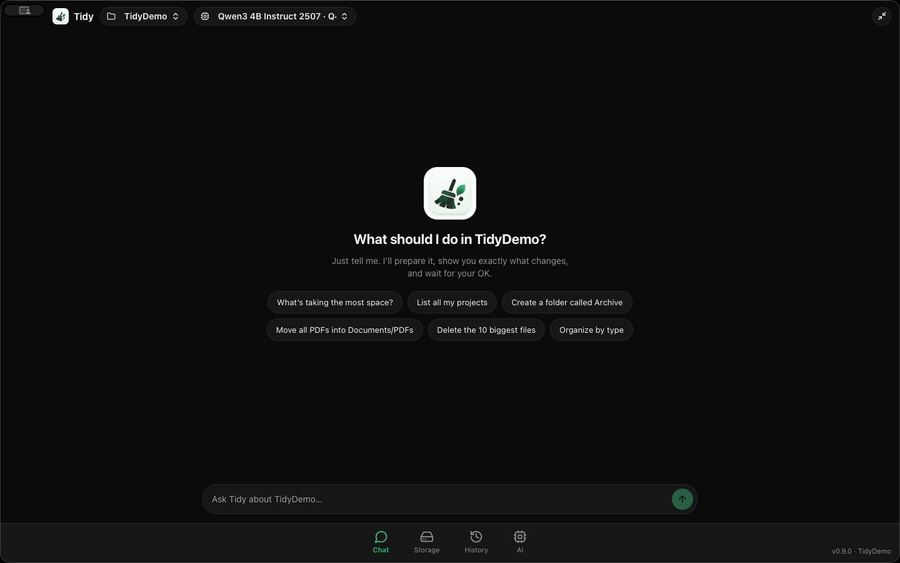 |
| “**Organize this folder by type**” | Images, Documents, Installers… in reviewed 500-item batches; **Undo all** restores it. | 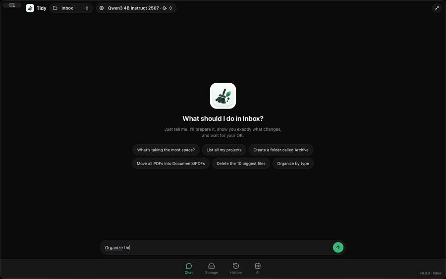 |
| “**Rename setup.dmg to Installer and move it into Archive**” | Two steps, one reviewed plan and one approval; **Put back** undoes both at once. | — |
| “**Replace spaces with underscores in file names**” | Bulk renames with collision checks; contents never change. | 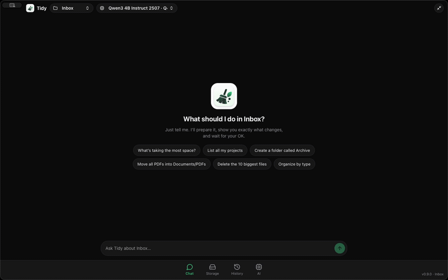 |
| “**Find duplicate files and remove the extra copies**” | Hashes files of equal size, keeps the oldest, trashes the rest. | 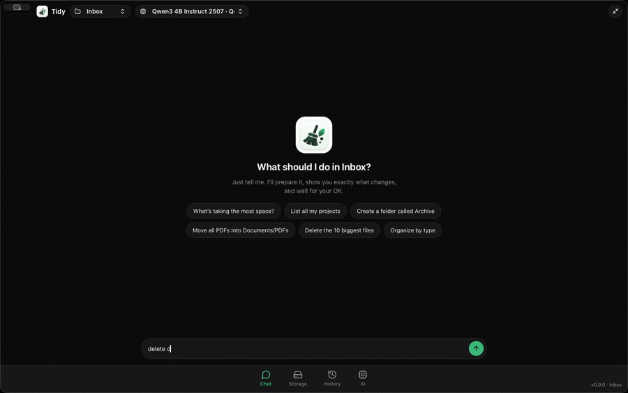 |
| “**List all my projects**” | Finds them by `package.json`, `Cargo.toml`, `.git`… with type and last change. | 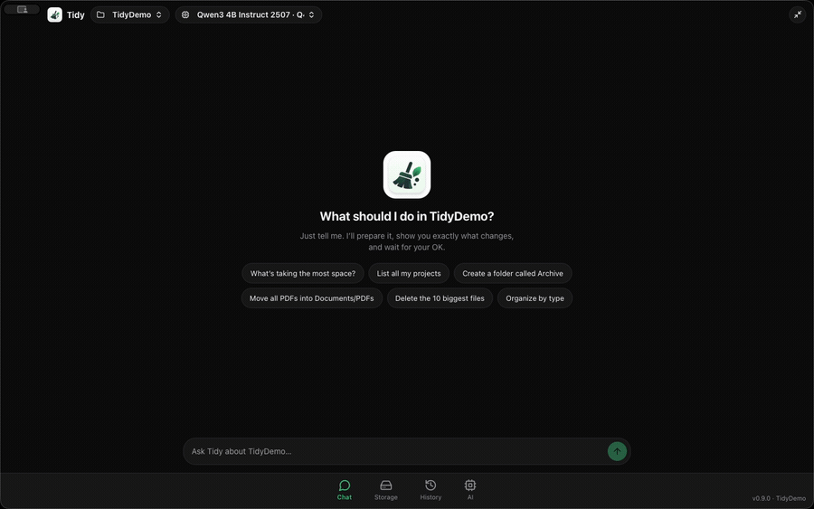 |

> Every row above is covered by an automated end-to-end test on a mock folder — see [Quality](#-quality).

## 🛡️ Safety is the product

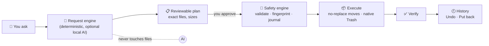

| Guarantee | How |
|---|---|
| **You choose what Tidy can see** | Per-folder switches; everything else is invisible to the assistant. |
| **Nothing changes without approval** | One-use, expiring tokens bound to the exact actions; a folder edited after review refuses to run. |
| **No overwrites** | `RENAME_EXCL` no-replace moves; collisions are skipped and reported. |
| **No permanent deletion — anywhere in the code** | Removal is the native Trash, with its recovery location recorded for Put back. |
| **Symlink & race safe** | Handle-relative, no-follow traversal; mount boundaries respected; `.git` internals never opened. |
| **Only one crate can mutate files** | `crates/safety`. The UI, the request engine and the AI model can only *propose*. |
| **Offline** | The only network use is you pressing *Download model* (pinned by revision + SHA-256). |

Full threat model: [docs/ARCHITECTURE.md](docs/ARCHITECTURE.md).

## 🤖 AI, used where it helps

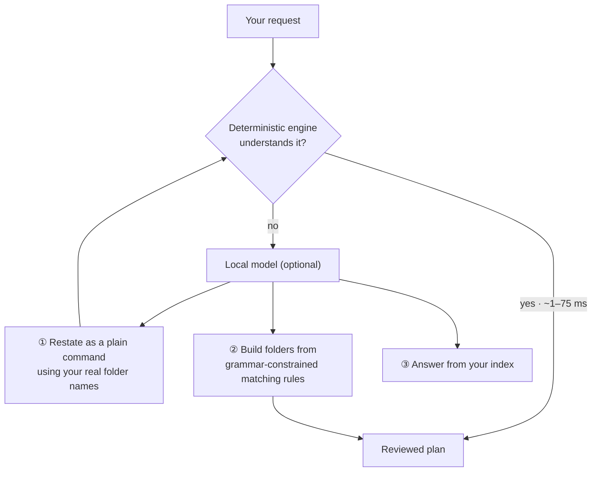

Small models are unreliable planners but good at *rewriting* and *classifying*, so Tidy uses AI for that and code for precision. Details, model list and how to add your own: [docs/HOW-AI-IS-USED.md](docs/HOW-AI-IS-USED.md).

## 📦 Install

**Download** `Tidy-<version>-macos-arm64.dmg` from [Releases](https://github.com/NicolasLasch/Tidy/releases/latest), drag **Tidy** to Applications. Builds are not notarized yet, so on first launch right-click → **Open**, or:

```sh
xattr -dr com.apple.quarantine /Applications/Tidy.app
```

Check the download: `shasum -a 256 -c SHA256SUMS.txt`. Requires macOS 11+ (Apple Silicon recommended for local AI; Metal is used automatically).

<details>
<summary><b>Build from source</b></summary>

Needs Rust 1.90+, Node 22+, Xcode command-line tools and CMake.

```sh
git clone https://github.com/NicolasLasch/Tidy.git && cd Tidy/apps/desktop
npm ci
npm run worker:build     # pinned llama.cpp worker (once, ~5 min)
npm run desktop          # development app with hot reload
npm run package          # release bundle → target/release/bundle/macos/Tidy.app
```

</details>

## 🧪 Try it in 2 minutes

Never point a new tool at your real Documents first. Generate ~1,000 deliberately messy files:

```sh
cargo run --example make_mock -p tidy-agent-runtime -- ~/TidyMock --large
```

Open Tidy → **Storage** → **Add folder** → pick `~/TidyMock/Inbox`, then ask:

1. `what's taking the most space?`
2. `organize this folder by type` → approve → `organize by date` → **History → Undo all**
3. `delete duplicate files`
4. `replace spaces with underscores in file names`
5. `change all .txt files to .md`

## 🏁 Quality

* **140+ automated tests**: safety refusals, indexer, request engine, and **end-to-end scenarios that run the real safety engine on real files** — including a 1,000-file messy tree (organize by type/date then undo everything, bulk renames, extension changes, de-duplication, 500-action batches, Put back) verified byte-for-byte. CI runs fmt, clippy `-D warnings`, the full suite and a secret scan on every push.
* **Fast**: understanding a request takes ~1 ms at 1,000 files and ~30–75 ms at 50,000; a 50,000-file folder moves to the Trash (and back) with one atomic rename.

| 1,000 files | 10,000 files | 50,000 files |
|---:|---:|---:|
| request 1 ms · rescan 45 ms | request 7 ms · rescan 0.46 s | request 31 ms · rescan 3.0 s |

Full tables: [docs/BENCHMARKS.md](docs/BENCHMARKS.md) · reproduce with `cargo run --release --example benchmark -p tidy-agent-runtime`.

## 🧱 Under the hood

**Tauri 2** (Rust) + **React/TypeScript** · **SQLite/FTS5** index · **llama.cpp** worker (Metal/CPU) · **Qwen3** models via Hugging Face · no Electron, no Python, no cloud.

```
crates/platform       authorized roots, no-follow handles, protected paths
crates/file-indexer   scanner + SQLite index
crates/organization   pure planning (categories, dates, matching rules)
crates/storage        storage findings
crates/safety         the ONLY crate that mutates files (validate → approve → journal → execute → verify → undo)
crates/agent-runtime  request engine (intent.rs), model client and catalog
apps/desktop          Tauri app: chat · storage explorer · history · models
native/inference      small llama.cpp worker
```

## 🗺️ Roadmap

- [x] Chat that plans, reviews and executes · whole-folder Trash · Put back
- [x] Whole-disk explorer with cached sizes · duplicates · bulk renames · extension changes
- [x] Local models with your own Hugging Face GGUFs
- [ ] Signed & notarized builds, auto-update (opt-in)
- [ ] Text search inside PDFs/Office docs · near-duplicate photos
- [ ] Windows & Linux · “recipes” you can share · keyboard-first mode

More in [docs/IDEAS.md](docs/IDEAS.md) — many are marked *good first issue*.

## 🤝 Community

Tidy is built in the open and **wants your ideas**: new request phrases, file categories, model recipes, translations, design feedback, bug reports. Start with [CONTRIBUTING.md](CONTRIBUTING.md), open an *Idea* issue, or say hi in [Discussions](https://github.com/NicolasLasch/Tidy/discussions). If Tidy saved you an afternoon, a ⭐ helps others find it.

[](https://star-history.com/#NicolasLasch/Tidy&Date)

## 🙏 Acknowledgements

[Tauri](https://tauri.app) · [llama.cpp](https://github.com/ggml-org/llama.cpp) · [Qwen](https://huggingface.co/Qwen) · [Hugging Face](https://huggingface.co) · [lucide](https://lucide.dev) · [nlohmann/json](https://github.com/nlohmann/json)

## 📄 License

[MIT](LICENSE). Bundled llama.cpp and nlohmann/json licenses ship in `apps/desktop/src-tauri/resources/inference/`.
